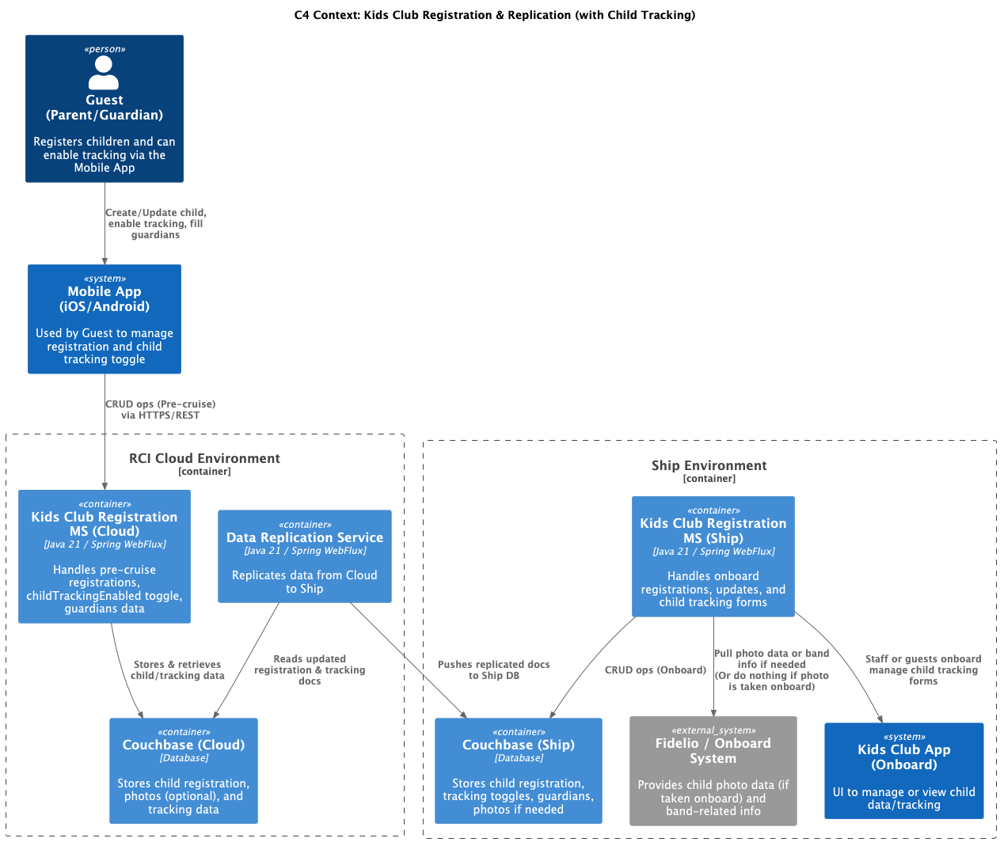
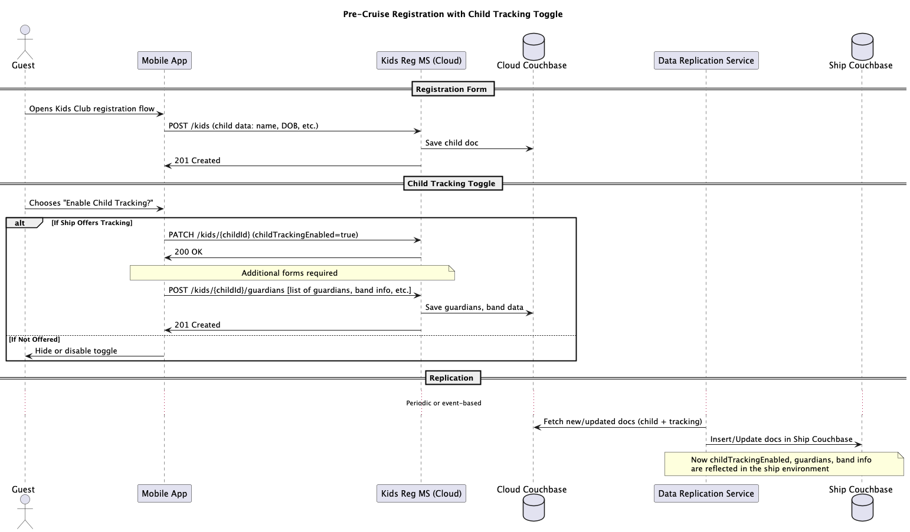

# Kids Club Registration & Replication with Child Tracking

This repository provides an overview of how guests register children before a cruise, enable child tracking (if offered), and replicate data from the cloud to an onboard ship environment.

## Table of Contents

1. [Overview](#overview)
2. [C4 Context Diagram](#c4-context-diagram)
3. [Pre-Cruise Sequence Diagram](#pre-cruise-sequence-diagram)
4. [Additional Notes](#additional-notes)

---

## Overview

- **Kids Club Registration Microservice (Cloud)**:
    - Handles all **pre-cruise** registrations.
    - Stores data in **Cloud Couchbase**.
    - If `childTrackingEnabled` is true and the ship supports tracking, additional **guardian** and **band** info is collected.

- **Data Replication Service**:
    - **Custom** logic to replicate updated child registration (and tracking data) from **Cloud Couchbase** to **Ship Couchbase**.

- **Kids Club Registration Microservice (Ship)**:
    - Receives replicated data for onboard reference.
    - Allows further **updates** or changes if the guest wants to modify info while on the ship.
    - May fetch **photo** data or band info from **Fidelio**, but some ships simply capture photos onboard and skip pre-cruise ingestion.

- **Kids Club App (Onboard)**:
    - Used by staff or guests onboard to **manage** or **view** child info, including tracking details, guardians, and so on.

---

## C4 Context Diagram

Below is the **C4 Context** visualization for the major components in the Cloud and Ship environments, plus the Mobile App and any external systems like **Fidelio**.

**Key Points**
1. The **Mobile App** communicates with the **Kids Club Registration (Cloud)** microservice.
2. Data is stored in **Cloud Couchbase** and **replicated** to **Ship Couchbase** via the **Data Replication Service**.
3. The **Kids Club Registration (Ship)** microservice reads/write data onboard and integrates with **Fidelio** if photo or band data is available or required.
4. The **Onboard Kids Club App** can display or manage child registration, including child-tracking forms.

---

## Pre-Cruise Sequence Diagram

Below is a **sequence diagram** illustrating how a guest registers a child before the cruise, optionally enabling child tracking and specifying guardians/band info. Afterward, the data is replicated to the ship.

**Sequence Explanation**
1. The **Guest** opens the Kids Club registration flow in the **Mobile App**.
2. A `POST /kids` request creates the child’s basic record in **Kids Reg MS (Cloud)**, persisted in **Cloud Couchbase**.
3. The user can **enable** child tracking (if offered by the specific ship). This triggers additional forms for **guardians** and **band** details.
4. The **Data Replication Service** runs on a schedule or event basis to **push** updated documents (child info, tracking toggle, guardian data) to the **Ship Couchbase**.
5. Once replicated, the **Kids Club Registration (Ship)** microservice can serve onboard staff and the onboard **Kids Club App** with accurate info.

---

## Additional Notes

- **Photo Capture**:
    - Photo capture of the child’s photo **onboard** (during embarkation). If so, **no** pre-cruise photo ingestion is needed.
    - Other ships may allow a photo upload during pre-cruise registration. That photo is stored in **Cloud Couchbase** and replicated to **Ship Couchbase**.

- **Tracking Toggle**:
    - If `childTrackingEnabled` is **false** or if the ship **does not** offer tracking, the user will not see additional guardian/band forms.
    - If `childTrackingEnabled` is **true** and the ship **does** offer tracking, extra forms appear to capture guardian permissions and band details.

- **Conflict Resolution**:
    - If the user updates the registration while still off-ship after the data has already been moved, calls may be **proxied** to the onboard service.
    - “Ship wins” or “last-write-wins” policies can be determined by business rules.

---

**End of Markdown Document**  
